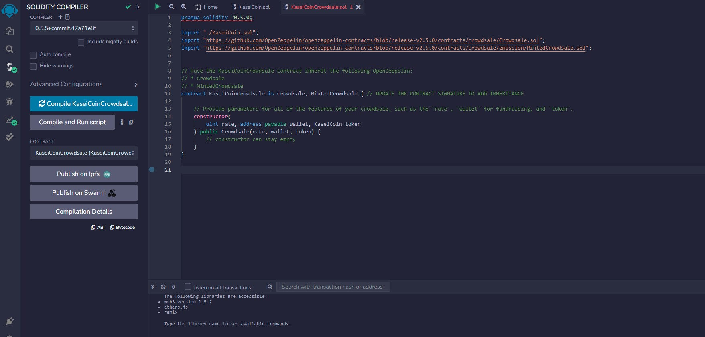
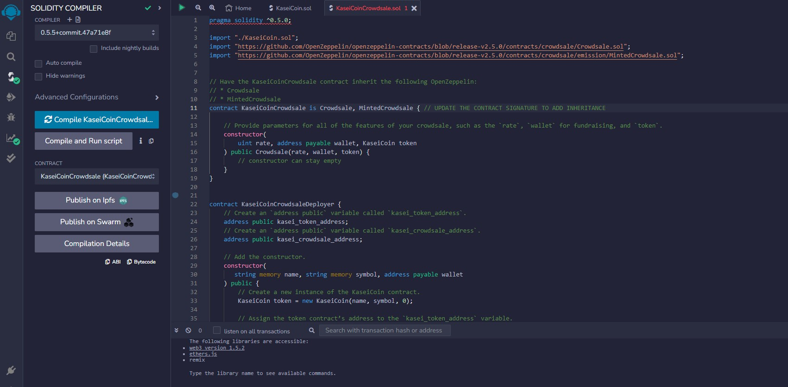

# Module_21_Challenge

In this project, we were tasked with developing a monetary system for the new Mars colony. To do so, we decided to base this new monetary system on blockchain technology, and to define a new cryptocurrency called KaseiCoin. KaseiCoin will be a fungible token that is ERC-20 compliant. Finally, we launched a crowdsale that will allow people who are moving to Mars to convert their earthling money to KaseiCoin.

---

## Technologies

* [Remix IDE](https://remix.ethereum.org/)
* [Solidity](https://soliditylang.org/) 

---

## Evaluation Evidence

**KaseiCoin Token**

**KaseiCoin Crowdsale**

**KaseiCoin Deployer**

**Crowdsale Deployment Interactions**

![]

---

## Contributors

Created by Maximus Accurso